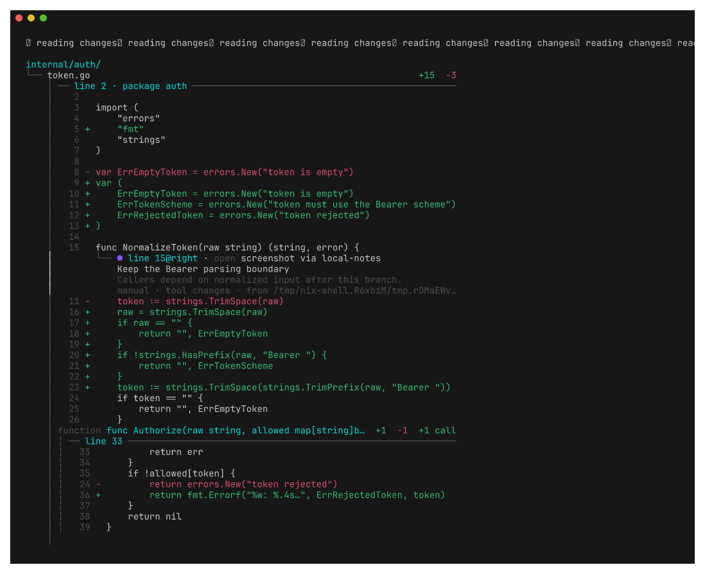

# changes

`changes` reads Git changes as a repository tree. It groups edits under
symbols and annotates them with changed call edges.

Git is the default display engine. Set `CHANGES_DIFF_ENGINE` to `delta`,
`difftastic`, `diff-so-fancy`, `internal`, or `command` to replace it.

```bash
export CHANGES_DIFF_ENGINE=delta
export CHANGES_DIFF_LAYOUT=side-by-side
```

The command engine reads a patch from standard input. Set its executable with
`CHANGES_DIFF_COMMAND` or `-engine-command`.

`changes render` provides the same patch input contract for another tool:

```bash
git diff | changes render
```

Install `git`, `ripgrep`, `ast-grep`, `tree-sitter`, and `calldiff` to enable
each analysis layer. Delta, Difftastic, and diff-so-fancy are optional.

Use Changes as a Git difftool:

```bash
git config diff.tool changes
git config difftool.changes.cmd 'changes difftool "$LOCAL" "$REMOTE" "$MERGED"'
git config difftool.prompt false
git difftool
```

Generate shell completions with `changes completion bash`, `zsh`, `fish`, or
`nu`.

## Development

```bash
nix develop
go test -race ./...
nix flake check
./hack/screenshots.sh
```


